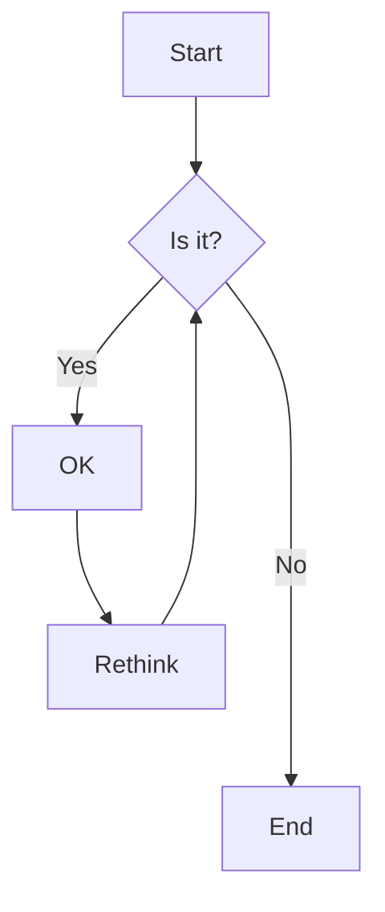





[I'm an inline-style link](https://www.google.com)

[I'm an inline-style link with title](https://www.google.com "Google's Homepage")

[I'm a reference-style link][Arbitrary case-insensitive reference text]

[I'm a relative reference to a repository file](../blob/master/LICENSE)

[You can use numbers for reference-style link definitions][1]

Or leave it empty and use the [link text itself].

URLs and URLs in angle brackets will automatically get turned into links.
<http://www.example.com> or <http://www.example.com> and sometimes
example.com (but not on Github, for example).

Some text to show that the reference links can follow later.

[arbitrary case-insensitive reference text]: https://www.themefisher.com
[1]: https://gethugothemes.com
[link text itself]: https://www.getjekyllthemes.com


This is a simple note.



This is a simple tip.



This is a simple info.



This is a simple warning.





#### Hey There, I am a tab





#### I wanna talk about the assassination attempt





#### We know you’re dealing in stolen ore




### Accordions



- Lorem ipsum dolor sit amet consectetur adipisicing elit.
- Lorem ipsum dolor sit amet consectetur adipisicing elit.
- Lorem ipsum dolor sit amet consectetur



> Did you come here for something in particular or just general Riker-bashing? And blowing into maximum warp speed, you appeared for an instant to be in two places at once.

### Tables

| Tables        |      Are      |  Cool |
| ------------- | :-----------: | ----: |
| col 3 is      | right-aligned | $1600 |
| col 2 is      |   centered    |   $12 |
| zebra stripes |   are neat    |    $1 |

### Image



### Gallery



### Slider



### Youtube video



### Custom video


